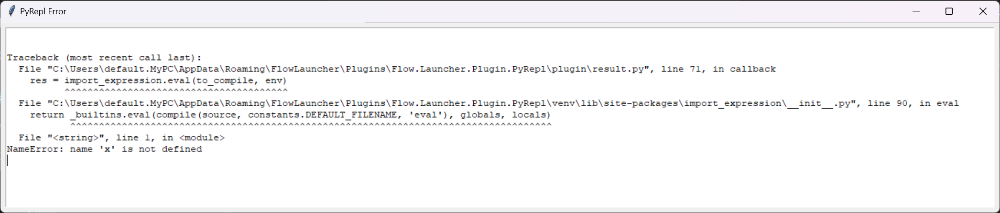

# Flow.Launcher.Plugin.PyRepl
A python repl implimentation in flow

## Features

- [Up to date python](#up-to-date-python)
- [Import Expressions](#import-expressions)
- [Custom 3rd Party Packages](#custom-3rd-party-packages)
- [Returning results without printing](#returning-results-without-printing)
- [Accessing previous result](#accessing-previous-result)
- [Viewing the console in flow](#viewing-the-console-in-flow)
- [Viewing full tracebacks](#viewing-full-tracebacks)
- [Custom ENV values](#custom-env-values)

### Up to date python

Flow Launcher's default python version uses 3.11. However, since PyRepl is built into an exe and as far as flow is concerned, not written in python, it gets to choose it's own python version. Here are a list of PyRepl versions and which version of python they ship with:

| PyRepl | Python |
|--------|--------|
|0.0.3|3.13.1|
|0.0.2|3.13.1|
|0.0.1|3.11.9|

### Import Expressions

If there is a package that you want to use that isn't apart of the default imports, you can add a `!` symbol after the package's name to import it automatically. Ex: `random!.choice(...)`.

### Custom 3rd Party Packages

If you want to use custom 3rd party packages with PyRepl, simply state the directory that contains the packages in the settings menu, and PyRepl will add it to path before executing your code.

### Returning results without printing

The first result that PyRepl will return is the result of the input.

### Accessing previous result

Before PyRepl returns the result, it will set the previous result to the `_` variable, so to access the previous result, use `_`.

### Viewing the console in flow

After the input's result, PyRepl will show each line that was printed to the console as a result.

### Viewing full tracebacks

In the case of an error, PyRepl will create a window that contains the traceback to easily access and read it.

### Custom ENV values

In the settings menu you can provide a dictionary in json form which will be added to the env parameter which is used when executing your code.

.png)